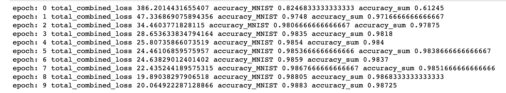
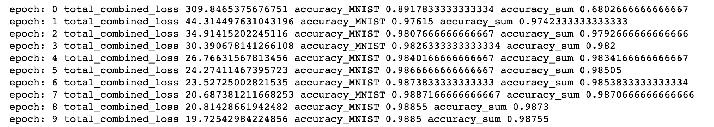

## Problem Statement
This assignment is based on the learnings from Pytorch session.

## Objective
To create a Neural Network which 
* Takes two inputs:
    * an image from MNIST dataset, and
    * a random number between 0 and 9
* Gives two outputs:
    * the "number" that was represented by the MNIST image, and
    * the "sum" of this number with the random number that was generated and sent as the input to the network. 

Eg: If MNIST image is 5 and input random number is 7 then the output will be 5 & 13.


Essentially there are 4 major parts to this problem:
1. __Network Architecture__: This will formulate the above problem statement into code. 
2. __DataSet Creation__: In order for the network to work properly i.e. give out the desired kind of the result, we need to pass the data in a proper format and also create a ground truth for the trainign to happen

3. __Choice of Loss Function__: This will determine if the training is happening properly or not. The choice of loss function is critical for the network to get trained. Loss function essentially  calculates the error which over the course of the training is reduced to as minimal as possible.

4. __Evalutaion__ : The network needs to be tested with a validation set or the data which the netwok has never seen so that we can determine if the network is overfitted or generalized. If the network gives very bad result on the test data but very good result on the training data then it implies that the network is overfitted.


**Note: For all the above key aspects of the problem we have written detailed analysis/notes in the jupyter notebook itself.**


### Data Creation Approaches
we want to mention that we experimented with two approaches to generate the data. The output is almost the same so cant decide which is better. Hence we have submitted both the notebooks for your reference. 
1. [Approach1](https://github.com/TSAI-END3-Group/Pytorch_Assignment/blob/master/notebooks/pytorch_assignment_solution_Approach1.ipynb)

2. [Approach2](https://github.com/TSAI-END3-Group/Pytorch_Assignment/blob/master/notebooks/pytorch_assignment_solution_Approach2.ipynb)

Broadly the two approaches are as follows

__Approach1:__ The dataset ```_init_``` function will generate MNIST images, MNIST labels, Random Numbers and the ```_getItem__``` function will pull out the 3 datapoints at the given index as an arrayLookup. After getting the MNISTLabel and Random Number it will add and return as Sum Label


__Approach2:__ The dataset ```_init_``` function will only generate MNIST images & MNIST labels. The Random Numbers & Sum Lables will be genreated on demand in the ```_getItem__``` function 


The MNIST data will be automatically downloaded if it is present in the notebook/data directory
The code snippets have been copied from the pytorch MNIST class. This helped in understanding the internals of pytorch datasets as well. We have augmented the MNIST class with the additional requirement of random number for this problem. The random number is being generated using the python function 

```randint(0,10)```


## Training Versus Test Infrastructure

Training has been done on GPU. However for the Testing (inference) in real world scenario we generally use CPU so just to highlight this fact we have moved the network from GPU to CPU and evalauted the test accuracy. 

```
## During training this code snippet will move the network parameters and the input tensor to GPU
device='cuda'
network.to(device) 

...
...

for(...):

    MNISTImages=batch["inputs"]["mnistImage"].to(device)
    MNISTLabels=batch["outputs"]["mnistLabel"].to(device)
    inputRands=batch["inputs"]["randomNumberTensor"].to(device)
    sumLabels=batch["outputs"]['sumLabelTensor'].to(device)

```


The testing parameters will already be on the CPU as by default the tensors will be on CPU. So no need to move them to CPU explicitly. Only the network parameters will be moved to CPU.

```
## During testing we will move the network from GPU to cpu 
device='cpu'
network.to(device)
```

## Must answered questions (from the assignment)
All the questions have been answered in quite details in the jupyter notebook at the appropriate places. Here we will give a short 1 liner.

1. **must mention the data representation**

    The random numbers will be generated using a 1-hot encoding of length 10 since the valid numbers to be generated are 0-9

    The output tensor will be a 29 length tensor where first 10 neurons represents MNIST label and next 19 neuron represents sum label.

    

2. **must mention your data generation strategy (basically the class/method you are using for random number generation)**
     The data is generated in two ways : MNIST images are downloaded from the standard MNIST URLs. There is a download function that will trigger if MNIST images are not locally present. If the local copy is present then the download does not happen.

     The random numbers are generated using the **randint()** python function.


3. **must mention how you have combined the two inputs (basically which layer you are combining)**


As shown in the diagram the concatenation happens before FC3

4. **must mention how you are evaluating your results** 

Since MNIST images come with 10000 test images we are using them along with 10000 random numbers to see if the network can predict correct MNIST label and sum labels.

5. **must mention "what" results you finally got and how did you evaluate your results**

Please see the results Section below

6. **must mention what loss function you picked and why!**

We are using the cross entropy loss. The detailed explaination is in [notebook](https://github.com/TSAI-END3-Group/Pytorch_Assignment/blob/master/notebooks/pytorch_assignment_solution_Approach1.ipynb)


## Results:
The **training accuracy** is **98%** for detecting the MNIST images and **97%** for detecting the correct Sum Labels after 10 epochs.
The **testing accuracy** is **~97%** for both MNIST images and Sum Labels.

### Logs
We have generated the training logs for the two approaches

1. [Approach1](https://github.com/TSAI-END3-Group/Pytorch_Assignment/blob/master/notebooks/pytorch_assignment_solution_Approach1.ipynb) __training log__



The log shows that after 10 epochs the accuracy for detecting MNIST labels is __98.8%__ and that of sum label detection is __98.7%__ while the loss started from 360 and came down to 20 

The network generalizes well for the test data :
__testing log__

The testing accuracy for both MNIST and sum labels is 98% and the loss is 0.3


2. [Approach2](https://github.com/TSAI-END3-Group/Pytorch_Assignment/blob/master/notebooks/pytorch_assignment_solution_Approach2.ipynb)



In this case also the trainging accuracy after 10 epochs is almost same as approach1. The log shows that after 10 epochs the accuracy for detecting MNIST labels is __98.8%__ and that of sum label detection is __98.7%__ . The loss after 10 epochs is also about 20


The network generalizes well for the test data :
__testing log__

The testing accuracy for both MNIST and sum labels is 98% and the loss is almost 0

This shows both the approaches are almost same


<hr>
We have also plotted the training data from approach 1 using the Tensorboard.


Below are the curves that we get from TensorBoard. ( we have used the ```tensorboard from torch.utils.tensorboard import SummaryWriter``` to write to the tensorboard)
#### Loss curve


#### Accuracy for detecting MNIST 


#### Accuracy for detecting Sum Labels


## Repository Files

1. [pytorch_assignment_solution_Approach1.ipynb](https://github.com/TSAI-END3-Group/Pytorch_Assignment/blob/master/notebooks/pytorch_assignment_solution_Approach1.ipynb) : Solution using approach1

2. [pytorch_assignment_solution_Approach2.ipynb](https://github.com/TSAI-END3-Group/Pytorch_Assignment/blob/master/notebooks/pytorch_assignment_solution_Approach2.ipynb) : Solution using approach2


## Contributors
* Rohit Agarwal
* Kushal Gandhi
* Vivek Kumar 
* Ammishaddai U
